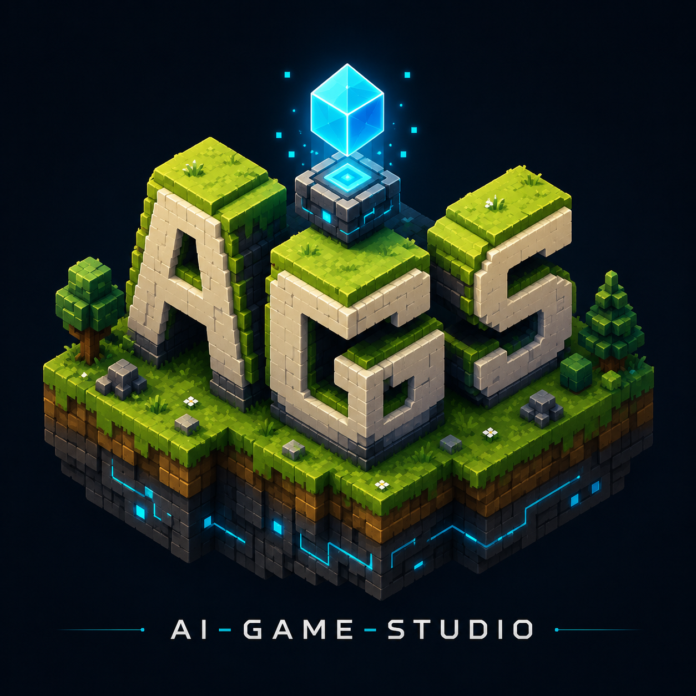

# AI Game Studio

<p align="center"></p>

> **Build Games at the Speed of Imagination.**

[](https://github.com/agilphp/ai-game-studio/actions/workflows/ci.yml)
[](https://github.com/agilphp/ai-game-studio/releases)
[](LICENSE)

**AI Game Studio** es una plataforma de desarrollo de videojuegos **AI-First** y **open source** que combina la productividad del paradigma visual de Adobe Flash (timeline, fotogramas, edición directa) con arquitecturas modernas (Rust, ECS, WGPU) e integra la Inteligencia Artificial como un miembro activo del equipo de desarrollo.

> **La IA conoce el videojuego y el videojuego conoce la IA.**

## Estado del proyecto

🎉 **MVP 0.1.0 publicado** (Fase 1 completa, hitos M0–M6). El ciclo *crear → animar → jugar* funciona de punta a punta **sin escribir código**. Ver el [CHANGELOG](CHANGELOG.md) y el [roadmap](ROADMAP.md).

## Empezar en 3 minutos

```bash
git clone https://github.com/agilphp/ai-game-studio && cd ai-game-studio
cargo install --path cli
aigs run examples/robot-rescue/game.aigs        # juega la demo
cd editor && npm install && npm run tauri dev   # abre el editor
```

Sigue la **[guía de inicio rápido](docs/guia-inicio.md)** para el tour del editor y tu primer juego en 8 pasos. Instaladores del editor y binarios del CLI en [Releases](https://github.com/agilphp/ai-game-studio/releases).

## Qué funciona hoy (0.1.0)

- 🎨 **Editor visual** (Tauri 2 + React): viewport con arrastre/zoom/pan, árbol de escena, inspector, recursos con importación, consola con métricas en vivo y undo/redo global.
- 🎞 **Timeline estilo Flash**: pistas por entidad y propiedad, keyframes arrastrables con easing, scrubbing y reproducción con preview en el viewport.
- 🕹 **Comportamientos sin código**: "cuando *tecla/clic/inicio de escena/fin de animación* → *mover / ir a escena / reproducir animación*", editados desde el inspector.
- ⚙️ **Runtime propio en Rust**: ECS con índices generacionales, render 2D instanciado sobre WGPU, game loop a 60 Hz con render interpolado, multi-escena. Consultar 10k entidades cuesta ~21 µs ([benchmarks](docs/testing.md)).
- 📄 **Formato `.aigs` AI-Ready**: todo el juego son archivos JSON legibles y versionables — la base para que la IA cree y modifique juegos completos ([especificación](sdk/aigs-format/SPEC.md)).
- 🔧 **CLI `aigs`**: `validate` y `run` para trabajar sin abrir el editor.

## Lo que viene

- **Fase 2**: física, audio, partículas, spritesheets, scripting y **exportación Desktop**.
- **Fase 3**: Android, Web (WASM) e iOS.
- **Fase 4**: IA profunda — chat nativo con contexto del proyecto, agentes especializados, generación de juegos completos.
- **Fase 5**: SDK de plugins, marketplace, colaboración.

## Ejemplos

Cada carpeta tiene su propio `README.md` con instrucciones de ejecución y controles.

| Proyecto | Qué demuestra |
|---|---|
| [`examples/robot-rescue/`](examples/robot-rescue/) | **Juego demo completo**: menú animado, nivel jugable (flechas + clic), dron con script y pantalla de victoria encadenada con `animation_end`. |
| [`examples/tamagotchi/`](examples/tamagotchi/) | **Mascota virtual persistente** (M13): stats que decaen en tiempo real incluso con el juego cerrado, cuidada con teclas 1/2/3, un único script. |
| [`examples/physics-playground/`](examples/physics-playground/) | Física 2D: cajas cayendo, pelota que rebota, robot que empuja cajas, sensor con partículas. |
| [`examples/hello-world/`](examples/hello-world/) | Proyecto mínimo: escenas, animaciones y comportamientos básicos. |
| [`examples/bouncing-sprites/`](examples/bouncing-sprites/) | Uso del runtime como biblioteca Rust, sin editor (cientos de sprites a 60 FPS). |

## Estructura del monorepo

| Directorio | Contenido |
|---|---|
| [`docs/`](docs/) | Documentación de diseño: visión, arquitectura, plan, guía de inicio, decisiones. |
| [`editor/`](editor/) | Editor visual — Tauri 2 + React + TypeScript. |
| [`runtime/`](runtime/) | Motor — crates Rust: `aigs-ecs`, `aigs-render`, `aigs-anim`, `aigs-project`, `aigs-runtime`. |
| [`cli/`](cli/) | Binario `aigs` (`validate`, `run`). |
| [`exporters/`](exporters/) | Exportadores por plataforma (Fase 2+). |
| [`sdk/`](sdk/) | Contrato público: especificación del formato `.aigs` y APIs de extensión. |
| [`examples/`](examples/) | Juegos de ejemplo y demos. |
| [`tests/`](tests/) | Tests de integración del sistema completo. |

## Documentación

- [Guía de inicio rápido](docs/guia-inicio.md) — instala, juega la demo y crea tu primer juego.
- [Proyecto completo](docs/proyecto.md) — qué es, por qué nace, filosofía y objetivos.
- [Plan maestro](docs/plan.md) — hitos del MVP (M0–M6) y fases siguientes.
- [Arquitectura](docs/arquitectura.md) — módulos, formato `.aigs`, tabla de decisiones.
- [Visión](docs/vision.md) · [Editor](docs/editor.md) · [Runtime](docs/runtime.md) · [IA](docs/ia.md) · [Exportadores](docs/exportadores.md) · [Plugins](docs/plugins.md) · [Testing](docs/testing.md) · [CI/CD](docs/ci-cd.md)

## Tecnologías

**Rust** · **WGPU** · **Tauri 2** · **React** · **TypeScript** · **Ollama / Claude / GPT / Gemini** (Fase 4)

## Contribuir

El proyecto es abierto a la comunidad. Lee [CONTRIBUTING.md](CONTRIBUTING.md) para empezar. El desarrollo sigue una metodología **AI First**: este MVP fue diseñado, implementado, probado y documentado en colaboración con IA, con trazabilidad completa en [CLAUDE.md](CLAUDE.md).

## Autoría

Creado por **efrasoft@gmail.com** en **HarnessOS** con **Visual Studio Code** y **Claude**.

## Licencia

[MIT](LICENSE)
